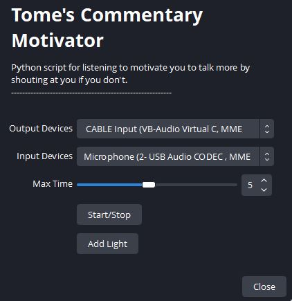

# OBS-Commentary-Motivator
This programme will help motivate you to talk will streaming using OBS.

# How to Use
To use this programme, you must add the "Commentary_Judge.py" file to your OBS "Scripts" tabs which can be found under "Tools".

# Setup
- First you must set your input and ouput devices (I'm not confident in my audio knowledge so let me know if there is a problem).
- Optional: You can add a image into your obs that will indicator if you are talking by pressing the add light button. This will create a new source called "Speach Light (Tome)" with two filters "red" and "green". Do what you like with this, i.e. resize, change filter colours, change image, etc.
- Set the max time to whatever amount of time you realistically go without talking on stream.
- Press start to begin.

# What does the "Commentary Motivator" actually do
When you start the programme, it will start counting down from the max time you set, and will listen to your mic for when you talk. Once the programme hears a sound it will gauge over 5 seconds whether you having being speaking enough to be considered talking. If this is the case the countdown will be reset. However, if you don't talk enough and the countdown times out, the max time will then be cut in half and you will be chastised. So try your best to keep the countdown from becoming unmanageably short. 
